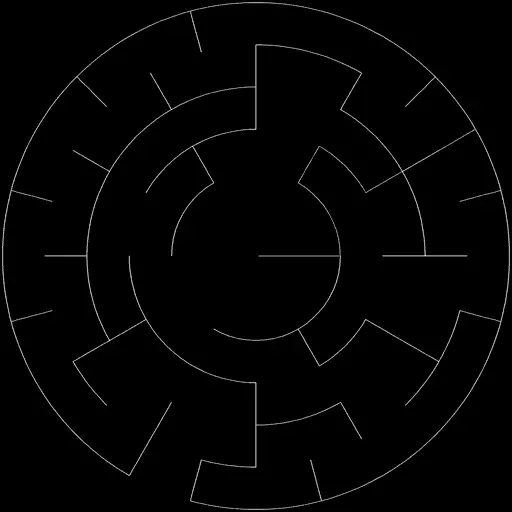
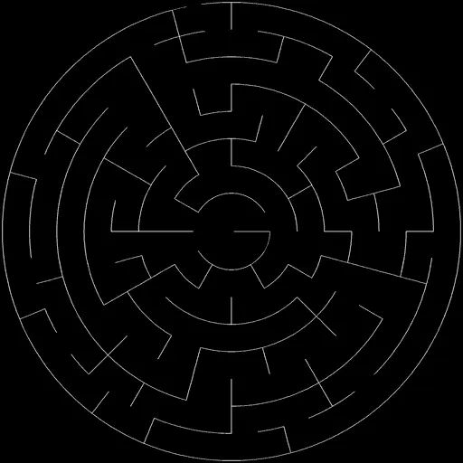

# Dune Weaver Maze Generator

A browser-based circular maze generator for the [Dune Weaver](https://github.com/tuanchris/dune-weaver) sand table. Generate solvable polar mazes, preview them live, save them to your table's pattern library with one click, and even **solve them interactively** by driving the steel ball through the corridors with an on-screen d-pad — including a first-person view that turns your sand table into a tabletop maze game.

The whole app is one self-contained HTML file. No build step, no dependencies, no package manager. Drop it in and go.

## Gallery

A few mazes generated with this tool, rendered the way Dune Weaver would draw them in sand:

| | |
|:---:|:---:|
|  |  |
| A short, low-ring maze — quick to solve, ideal for first-time players or kids | A long, high-ring maze with deep nested corridors — a real puzzle in sand |

---

## Installation

This page is designed to be served from your Dune Weaver controller so that the **Save** button can upload `.thr` files and the **Solve** mode can drive the table in real time. All API calls are made to the same origin the page is served from.

1. Locate your Dune Weaver installation directory (the one containing `app.py` / the controller code).
2. Inside that directory, find (or create) the `static/` folder.
3. Copy `maze.html` into `static/`:

   ```bash
   cp maze.html /path/to/dune-weaver/static/maze.html
   ```

4. With your Dune Weaver controller running, open the page in any browser:

   ```
   http://<your-dune-weaver-host>/static/maze.html
   ```

   Replace `<your-dune-weaver-host>` with the IP address or hostname of the device running the controller (e.g. `http://dune-weaver.local/static/maze.html` or `http://192.168.1.42/static/maze.html`).

That's it — there's nothing to install or build.

### Where saved mazes go

When you click **Save**, the page `POST`s the generated theta-rho data as a `.thr` file to the Dune Weaver controller's `/upload_theta_rho` endpoint. The controller writes it into the **`custom_patterns/`** directory inside your Dune Weaver installation, where it appears alongside your other patterns in the main Dune Weaver UI and is ready to play on the table.

The page also keeps a list of recently saved mazes in your browser's `localStorage` (under the keys `maze_state_standalone` and `maze_saved_standalone`), so you can re-launch them or jump straight back into solve mode without regenerating. Clearing browser storage forgets this list but does not delete the `.thr` files on the controller.

---

## Quick start

1. Open `http://<host>/static/maze.html`.
2. Type a number into **Rings (3–8)** — start with `6` if you're not sure.
3. Click **Generate Maze**. A circular maze appears in the preview, with a green dot marking the entrance on the rim and a red dot at the center.
4. Click **Save**, give it a name, and the `.thr` is uploaded to your table.
5. Either click **Play** to draw the maze in sand, or click **Solve** to enter interactive solve mode and steer the ball through the corridors yourself.

---

## How it works

The generator is a port of a circular ("theta-rho") maze algorithm to plain JavaScript. The pipeline is:

1. **Build a circular grid.** Concentric rings are subdivided into sectors. Inner rings have fewer sectors than outer ones — every time a cell's arc length grows past about twice its radial height, the sector count for the next ring out doubles. This keeps every cell roughly square no matter where it sits on the table.
2. **Carve a perfect maze.** A seeded recursive backtracker walks the grid from a random outer-rim cell, knocking down walls between unvisited neighbors until every cell is reachable from every other cell exactly one way. The seed is logged in the toast so you can recognize a maze you like.
3. **Pick an entrance and exit.** The starting cell on the rim becomes the entrance (green dot). The center cell is opened to one of its neighbors so the maze has a true exit (red dot).
4. **Extract walls.** Each remaining wall becomes either an `arc` (a piece of a ring boundary) or a `radial` (a spoke between two rings).
5. **Trace the walls into one continuous path.** A DFS walks the wall graph; when it gets stuck, it uses Dijkstra over the wall network itself to slide the ball to the nearest unwalked wall along *another wall*. This means the table's drawing head almost never has to jump across an open corridor — most of the path is real wall, drawn in the sand.
6. **Return to the entrance.** After every wall is drawn, a final Dijkstra path retraces along walls back out to the rim, then arcs along the perimeter to the entrance — so the maze ends with the ball parked at the start, ready to be solved.
7. **Unwrap theta.** Theta is accumulated across full revolutions (no `2π` wrapping), which is what the Dune Weaver firmware expects for `.thr` files.

The result is a single continuous polar path that draws every wall of the maze, with as little open-space travel as the wall graph allows.

---

## Controls reference

### Top bar

| Control | What it does |
|---|---|
| **Rings (3–8)** | Number of concentric rings. Higher = bigger, more difficult maze. The center disc is always one cell; the number you type is the count of *rings around* that center. |
| **Generate Maze** | Runs the generator with a fresh random seed. The seed is shown in the toast — note it down if you want to remember a specific maze. |
| **Settings** (gear icon) | Adjusts solve-mode movement granularity (see below). |

### After generation

| Button | What it does |
|---|---|
| **Save** | Prompts for a pattern name and uploads `<name>.thr` to the controller via `/upload_theta_rho`. Filenames are sanitized to `[A-Za-z0-9 _-]`. |
| **Play** | (Visible after Save.) Tells the controller to play the saved `.thr` file via `/run_theta_rho`, drawing the maze in sand. |
| **Solve** | Enters interactive solve mode (see below). |

### Saved Mazes panel

The bottom card lists every maze you've saved from this browser. Each row has:

- **Play** — replay that maze's `.thr` on the table.
- **Solve** — drive the ball through that maze interactively (only available for mazes saved from this browser, since solve mode needs the grid data, not just the `.thr`).
- **✕** — forget the entry from `localStorage`. *This does not delete the `.thr` file on the controller* — you can still find it in the main Dune Weaver UI under custom patterns.

---

## Solve mode

This is the killer feature: turn your sand table into an actual maze game. After **Solve**, the ball is moved to the maze entrance on the rim, and a d-pad appears.

### Default mode (compass)

| Key | Direction |
|---|---|
| ↑ | Move outward (toward the rim) |
| ↓ | Move inward (toward the center) |
| ← | Rotate counter-clockwise |
| → | Rotate clockwise |

Walls block movement — if there's no opening in the requested direction you simply don't move. Reach the center cell to win; a green "Maze solved!" message appears.

### First-person view

Tick **First-person view** below the d-pad to switch to FPV controls:

| Key | Direction |
|---|---|
| ↑ | Forward (the way you're "facing") |
| ↓ | Reverse (180° from facing) |
| ← | Turn left relative to facing |
| → | Turn right relative to facing |

The label below the d-pad shows your current facing (`in`, `out`, `cw`, or `ccw`), so you always know which way "forward" is. This makes the maze feel like a top-down dungeon crawler — much harder, much more fun.

### Step size

Open **Settings** (the gear) to tweak **Move distance per press**, a fraction of one cell's radial height per d-pad press:

- **Lower (0.05–0.20)** — small, careful nudges. Good for fine maneuvering.
- **Higher (0.50–1.00)** — bigger jumps; you cross a cell in one or two presses. Walls still block.

Holding a d-pad button auto-repeats the move. The setting persists in `localStorage`.

### What's happening under the hood

Solve mode talks to two stock Dune Weaver endpoints:

- `POST /send_coordinate` with `{ theta, rho }` — moves the ball to a polar coordinate.
- `POST /run_theta_rho` — used elsewhere for Play.

There is no special server support — solve mode works on any vanilla Dune Weaver controller.

---

## Tips

- **Difficulty scales fast.** A 3-ring maze is a quick puzzle; a 6-ring maze is a real challenge; an 8-ring maze takes a while. Don't start with 8.
- **Note the seed.** Every successful generation toasts `Maze generated (seed: 123456)`. There's no UI to type a seed in, but if you want to share or recreate a specific maze you can edit the call to `generateMaze(rings, 12, <seed>)` near the bottom of `maze.html`.
- **Use Solve before Play.** Solving the maze in sand and *then* drawing it makes a satisfying "before and after" pattern — the ball's solve path leaves a trail through the corridors, and Play then etches the walls on top.
- **First-person view + bigger step size** = the most "video game" experience the table is capable of.
- **Saved mazes are per-browser.** The Solve button on a saved row needs the grid data that was generated alongside the `.thr`. If you want to solve a maze from a different machine, regenerate and re-save it there.

---

## File format

Saved files are plain text. One `theta rho` pair per line, space-separated, 3 decimal places:

```
0.000 0.010
0.000 0.196
0.000 0.383
...
```

- `theta` is in radians and **accumulates** across full revolutions (it is *not* clamped to `[0, 2π]`).
- `rho` is in `[0.01, 1]`, where `~0` is the table center and `1` is the rim.

This is the standard Dune Weaver `.thr` format, so saved mazes are interchangeable with anything else in your `custom_patterns/` directory and can be played, queued, or sequenced like any other pattern.

---

## Endpoints used

The page only uses stock Dune Weaver endpoints — no patches or plugins required:

| Endpoint | Method | Used for |
|---|---|---|
| `/upload_theta_rho` | `POST` (multipart) | Save → uploads `<name>.thr` into `custom_patterns/`. |
| `/run_theta_rho` | `POST` (JSON: `{ file_name, pre_execution }`) | Play → tells the table to draw a saved file. |
| `/send_coordinate` | `POST` (JSON: `{ theta, rho }`) | Solve mode → moves the ball one step at a time. |

If your controller version exposes these under different paths, you'll need to update the constants near the bottom of `maze.html` (search for the `API` constant and the three `fetch` calls).

---

## Troubleshooting

**"Upload failed" when clicking Save.**
The page must be served from your Dune Weaver controller. It `POST`s to a relative `/upload_theta_rho` URL on the same origin. If you opened the file with `file://` or served it from an unrelated static server, the endpoint won't exist. Move the file into the controller's `static/` directory as described in [Installation](#installation).

**Solve mode does nothing when I press the d-pad.**
Each press calls `/send_coordinate`. If the controller is busy with a previous job, or the endpoint isn't responding, the button presses won't move the ball. Check your browser console for errors and confirm the controller is idle. Also check that no other UI is currently sending the table commands.

**The maze entrance and the ball don't line up when I enter solve mode.**
Solve mode commands the ball to `theta=<entrance angle>, rho=1.0` before handing control over. If the table's homing is off, the on-screen entrance and the physical ball can drift apart. Re-home the table from the main Dune Weaver UI before starting solve mode.

**My saved maze doesn't show up in the Saved list.**
The Saved list lives in `localStorage` and is per-browser. If you cleared site data, used a private window, or saved from a different device, the entry won't appear here — but the `.thr` file still exists in `custom_patterns/` on the controller.

**Maze generation hangs the page on rings = 8.**
The 8-ring case can take a couple of seconds to trace because the wall graph gets large and Dijkstra is invoked repeatedly. The button shows "Generating..." while it works. If it never finishes, open the console — there should be no errors, just be patient on slower devices.

**Pattern looks great in preview but the table draws something different.**
The preview shows the maze's wall layout. The table draws the actual continuous path returned by the wall tracer, which includes the final retrace back to the entrance. They should match visually, but the *order* in which walls are drawn is path-determined and not always the most "obvious" order.

---

## License

See [LICENSE](LICENSE).
